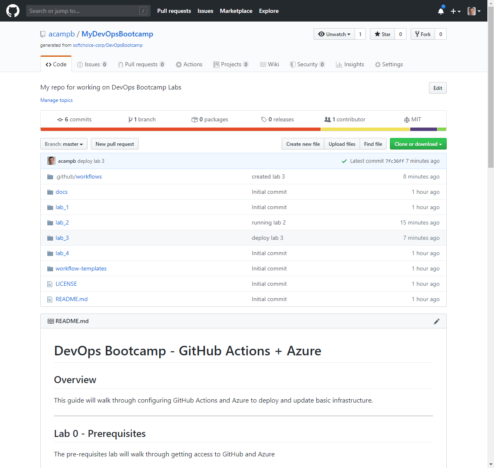
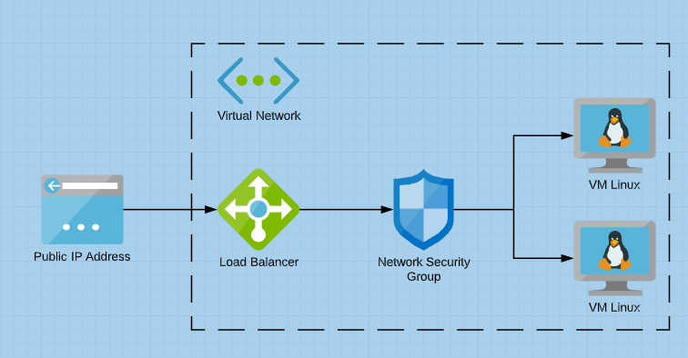
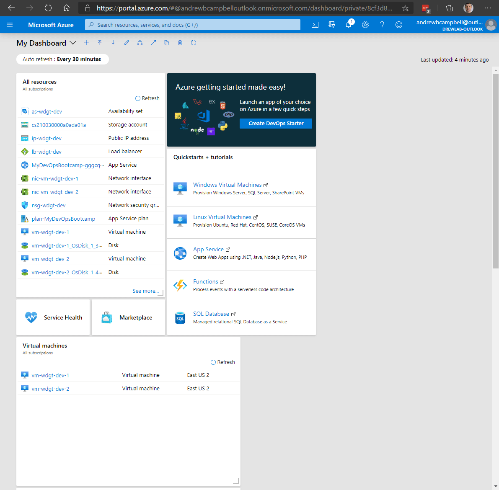
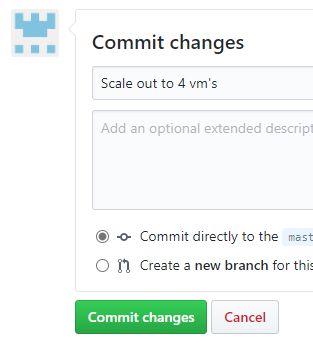
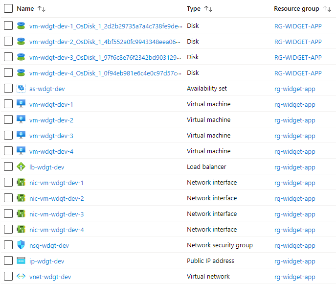
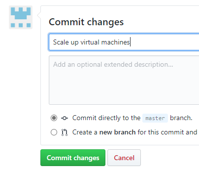

# Lab 2 - IaaS

- [Configure GitHub Actions](#Configure-GitHub-Actions)
- [Run GitHub Actions](#Run-GitHub-Actions)
- [Scale Up Resources](#Scale-Up-Resources)
- [Scale Out Resources](#Scale-Out-Resources)
- [Clean Up Resources](#Clean-Up-Resources)

---

## Overview

The second lab will deploy IaaS components consisting of Virtual Networking, Virtual Machines, Load Balancer using an Azure Resource Manager Template via a GitHub Actions CI/CD pipeline.

> Note: Lab 2 uses the same service principal credential we created in Lab 1.

---

## Configure GitHub Actions

1. In GitHub Navigate to the **Code** tab, browse to the `workflow-templates` directory, and open the `lab_2_iaas.yml` file and copy all of the text.

> 

2. Navigate to **Actions** and click **New workflow**. If prompted to start with a sample workflow click the `Set up a workflow yourself` button in the top right.

3. Replace all of the sample workflow code in the editor by pasting all the code you copied from `workflow-templates/lab_2_iaas.yml`.

4. In this workflow we are using Environmental Variables to define the name of the Azure Resource Group to be created, and the Azure Region to deploy the resources in. Modify this section of the file to specify different values if desired.

```yaml
env:
  RG_NAME: rg-lab-2
  LOCATION: eastus2
```

> Note: If changing the `LOCATION` variable, ensure that you use the proper Azure Region name. You can list the available regions for your subscription by running this command `az account list-locations -o table` in Azure Cloud Shell.

5. GitHub Actions files must be saved in a directory in your repo named `.github/workflows/`. The directory structure `.github/workflows/` should already exist in the path, name your workflow file `lab_2_iaas.yml` and click `Start Commit`.

6. Add a short commit message and click `Commit new file`

---

## Run GitHub Actions

The workflow we just created is triggered by changes made to the files in the `lab_2/` directory. Let's make a change here to kick off the workflow. The `readme.txt` can be modified by simply adding a new line or some text. The act of committing this change to the `master` branch will instruct GitHub Actions to kick off our workflow.

1. Navigate to **Code**, and browse to the `lab_2/readme.txt` file. Click the pencil icon to edit the file, and add a new line. Provide a commit message and commit your change.

2. Navigate to **Actions** and you should see your `Lab_2_IaaS` workflow executing.

The workflow for Lab 2 is going to take a few minutes to execute. While it is running let's take a look at the differences in the `lab_2_iaas.yml` file:

The `on:` and `name:` sections are very similar to our Lab 1 workflow. The workflow is initiated by a change to any file in the `lab_2/` directory.

The `env:` section defines two environment variables. These are two variables that will be referenced later in our workflow, defining the name of the resource group and Azure region to use.

```yaml
env:
  RG_NAME: rg-lab-2
  LOCATION: eastus2
```

The `jobs:` section is also similar to our Lab 1 workflow, but we're using the `azure/CLI@v1` Action to run two Azure CLI commands as inline scripts. These are used to create the Azure Resource Group, and then perform and Azure Resource Manager deployment into that Resource Group using the ARM Template `lab_2/iaas.deploy.json`.

```yaml
- name: Create Resource Group
    uses: azure/CLI@v1
    with:
      inlineScript: |
        az group create --name $RG_NAME --location $LOCATION

- name: Deploy ARM Template
    uses: azure/CLI@v1
    with:
      inlineScript: |
        az deployment group create --resource-group $RG_NAME --template-file lab_2/iaas.deploy.json
```

The ARM template file defines several Azure resources to deploy:

- Virtual Network with two subnets
- Two Ubuntu Linux virtual machines
- Availability Set
- Network Security Group with rule for allowing port 80 inbound
- Public Ip Address
- Load Balancer configured with listener, routing rule, and backend server pool populated with Linux vm's

> 

3. Once the workflow has completed you can access the Azure Portal ([https://portal.azure.com](https://portal.azure.com)) and view the resources the workflow created. In the Azure Portal click the top left &#9776; hamburger menu, click **Resource Groups**, and select `rg-lab-2`.

> 

---

## Scale Out Resources

Let's scale out the solution from 2 virtual machines to 4.

1. Navigate to **Code** and browse to the `lab_2/iaas.deploy.json` file.

2. Click the pencil icon to edit the file. The first parameter; `webServerNames` is an array containing multiple server names. The ARM template contains logic that will loop through this array and create a virtual machine, nic, and disk for each server name specified. Add `vm-wdgt-dev-3` and `vm-wdgt-dev-4` to the list of server names.

```json
"webServerNames": {
    "type": "array",
    "defaultValue": [
        "vm-wdgt-dev-1",
        "vm-wdgt-dev-2",
        "vm-wdgt-dev-3",
        "vm-wdgt-dev-4"
    ]
},
```

3. Enter a commit message and click `Commit changes`

> 

4. Navigate to **Actions** and you should see your workflow executing.

> 

5. Once the workflow is completed we can open the Azure Portal and confirm there are now four virtual machines deployed. We can also check the Load Balancer and see that all 4 are already configured in the backend server pool.

> 

---

## Clean Up Resources

To mimimize billing usage in your subscription we can remove all of the resources we deployed with GitHub Actions by deleting the Resource Group they are held in. From Azure Cloud Shell run the following command:

```python
az group delete --name rg-lab-2
```

> Note: If you modified the Resource Group name variable at the beginning of Lab 2 you will need to provide the correct Resource Group name.

---

## End of Lab 2

Links to more learning:

- **GitHub Actions Variables**: [https://help.github.com/en/actions/configuring-and-managing-workflows/using-environment-variables](https://help.github.com/en/actions/configuring-and-managing-workflows/using-environment-variables)
- **Azure Resource Manager Deployments**: [https://docs.microsoft.com/en-us/azure/azure-resource-manager/management/overview](https://docs.microsoft.com/en-us/azure/azure-resource-manager/management/overview)
- **ARM Templates**: [https://docs.microsoft.com/en-us/azure/azure-resource-manager/templates/overview](https://docs.microsoft.com/en-us/azure/azure-resource-manager/templates/overview)
- **ARM Template Copy Element**: [https://docs.microsoft.com/en-us/azure/azure-resource-manager/templates/copy-resources](https://docs.microsoft.com/en-us/azure/azure-resource-manager/templates/copy-resources)
- **Azure Virtual Network**: [https://docs.microsoft.com/en-us/azure/virtual-network/virtual-networks-overview](https://docs.microsoft.com/en-us/azure/virtual-network/virtual-networks-overview)
- **Azure Virtual Machines**: [https://docs.microsoft.com/en-us/azure/virtual-machines/linux/overview](https://docs.microsoft.com/en-us/azure/virtual-machines/linux/overview)
- **Azure Load Balancer**: [https://docs.microsoft.com/en-us/azure/load-balancer/load-balancer-overview](https://docs.microsoft.com/en-us/azure/load-balancer/load-balancer-overview)
- **Azure Virtual Machine Quotas**: [https://docs.microsoft.com/en-us/azure/azure-resource-manager/management/azure-subscription-service-limits#virtual-machines-limits](https://docs.microsoft.com/en-us/azure/azure-resource-manager/management/azure-subscription-service-limits#virtual-machines-limits)


## Optional Scale Up Resources

This exercise will go through scaling up the deployed Virtual Machines to a different SKU with more vCPU and Memory resources.

> NOTE: If you are using an Azure Free Account you may need to upgrade to a Pay-As-You-Go account in order to perform these steps. Azure has been limiting the vCPU Core quotes and denying quota increase requests on Free accounts. Completing this optional step is not required, and

| VM SKU       | CPU Cores | Memory | Data Disks |
| ------------ | --------- | ------ | ---------- |
| Standard_B1s | 1         | 1 GB   | 2          |
| Standard_B2s | 2         | 4 GB   | 4          |

1. Navigate to **Code** and browse to the `lab_2/iaas.deploy.json` file.

2. Click the pencil icon to edit the file. Change the `webVmSize` parameter by modifying the VM SKU size for `defaultValue` to be `Standard_B2s`

```json
"webVmSize": {
    "type": "string",
    "defaultValue": "Standard_B2s"
},
```

> Note: JSON has very strict formatting rules. When modifying the code be sure that you have correct quotation marks, commas, and brackets in the correct locations or your ARM deployment may fail.

3. Enter a commit message and click `Commit changes`

> 

4. Navigate to **Actions** and you should see your workflow executing.

> 

5. Once the workflow is completed we can open the Azure Portal and confirm the virtual machines have been reconfigured to the new size.

> 

---
